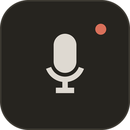
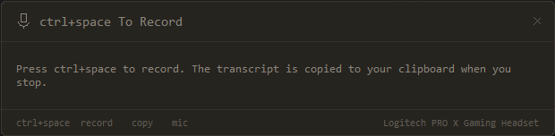

<div align="center">



# Voice2Text

**A quiet dictation bar that stays out of your way.**

Press a hotkey, talk, and watch the words appear as you speak. Stop, and the
transcript is on your clipboard.



<sub>Windows · Python 3.10+ · single 55 MB executable, no install</sub>

</div>

---

## Why

Most dictation tools take over the screen, steal your focus, or make you copy
text out of their own window by hand. Voice2Text is a 620×152 panel that stays
out of the way:

- **It never takes focus.** The window is `WS_EX_NOACTIVATE`, so clicking it
  does not disturb the text box you were typing in. Your cursor stays where you
  left it, ready to paste.
- **Words appear as you speak.** Audio is cut at natural pauses and each phrase
  is transcribed while you keep talking — not held back until you stop.
- **It never changes size.** The transcript scrolls inside a fixed body. Dictate
  for five minutes; the panel stays exactly as tall as it started.

## Use it

Download `Voice2Text.exe` from [Releases](../../releases), or build it below,
and double-click. Nothing to install — Python and all dependencies are bundled.

| Action | How |
| --- | --- |
| Start / stop recording | **`ctrl+space`**, from any application |
| Copy to clipboard | click **`copy`** — also automatic when recording ends |
| Choose a microphone | click **`mic`** or press `tab`, then click a row |
| Move the panel | drag it anywhere |
| Close | the **×**, or `esc` |

The typical loop: leave it running, `ctrl+space`, talk, `ctrl+space`, then
paste wherever you were typing.

> If `ctrl+space` is already claimed by another app, Voice2Text falls through a
> list of alternates and shows the one it actually got, in the header and the
> footer. It never advertises a key that will not work.

## The microphone picker

Press `tab` for the device list. The active mic is marked, likely-virtual
devices are labelled and sorted last, and the choice is remembered between runs.

Two Windows quirks this works around, both of which are easy to lose an
afternoon to:

- **The same microphone is listed several times.** Windows exposes one physical
  device through several APIs, and the MME backend truncates names at 31
  characters, so the duplicates do not even look alike. Rows whose names are a
  prefix of one another are collapsed, keeping the fullest spelling.
- **Device numbers move between runs.** The same headset was index 8 one run and
  26 the next, so a remembered index can silently select a different microphone.
  The choice is saved by name, in `~/.voice2text.json`.

While recording, a **level meter** in the header shows live input. If the bars
do not move, that device is not hearing you — press `tab` and pick another. Some
endpoints also stream garbage as fast as the process can read it; those are
detected and refused rather than allowed to fill memory.

## Build it

```bash
pip install -r requirements.txt
python voice2text.py           # run from source

pip install pyinstaller pillow
python make_icon.py            # regenerate icon.ico / logo.png
python -m PyInstaller --onefile --windowed --name Voice2Text \
       --icon icon.ico --clean voice2text.py
```

The executable lands in `dist/`. Note that PyInstaller freezes a *copy* of the
source, so edits to `voice2text.py` do not reach `dist/Voice2Text.exe` until you
rebuild — and the rebuild cannot overwrite the file while a copy is running.

## How it works

| Piece | Approach |
| --- | --- |
| Window | One Tk `Canvas`. Every pixel — the rounded panel, the microphone, the meter, the footer buttons — is drawn by hand, with `-transparentcolor` keying out the corners. |
| Capture | PyAudio directly, rather than `Recognizer.listen()`, so the app owns each buffer and can show levels and stop instantly. |
| Segmenting | A phrase ends after 0.6 s below the speech threshold, or 8 s regardless. The threshold comes from the room's measured noise floor at the start of each recording. |
| Transcription | Each phrase goes to Google Web Speech on its own thread. Results are sequence-numbered and held until their turn, so out-of-order replies cannot scramble the text. |
| Output | The transcript is put on the clipboard as soon as recording stops. Because the panel never takes focus, the text box you were typing in keeps its cursor, ready to paste. |

Requires a network connection — recognition is Google's Web Speech endpoint.

## Notes

- Windows only. The non-activating window and the global hotkey are both Win32.
- One instance at a time, enforced with a named mutex; a second launch exits so
  it cannot open a duplicate panel or lose the race for the hotkey.
- Recording is capped at five minutes per take.
